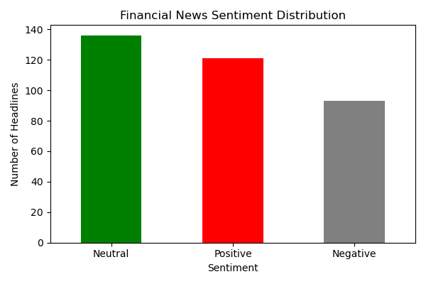

# Automated Financial News Sentiment Analyzer

This project collects financial news headlines from multiple trusted sources (CNBC, Financial Times, Investing.com), applies sentiment analysis, and generates daily reports with visual dashboards.

## Features
- Automated scraping of 300+ financial headlines across different categories.
- Sentiment analysis using **NLTK (VADER)** and **TextBlob** to measure polarity and subjectivity.
- Aggregated results exported to both **Excel (.xlsx)**.
- Clear **bar chart visualization** of sentiment distribution.
- Console summary showing positive, negative, and neutral sentiment breakdown.

## Tech Stack
- **Python** (Requests, BeautifulSoup, Pandas, Matplotlib)
- **NLTK** + **TextBlob** for sentiment analysis
- **RSS feeds** for reliable financial news collection
- **Excel & CSV** output for flexible use

## Example Output

- **Excel Report**: Sample generated report → `financial_sentiment_report_20250920.xlsx`  
- **Chart**: Sentiment breakdown saved as `sentiment_distribution.png`

## How It Works
1. Fetches live financial news headlines from CNBC, FT, and Investing.com.
2. Cleans and de-duplicates them (usually ~500 headlines per run).
3. Runs sentiment analysis (positive, negative, neutral).
4. Saves structured results into Excel and CSV.
5. Outputs a chart + console summary for a quick snapshot of market mood.

## Why I Built This
Markets move on sentiment as much as fundamentals. By analyzing news at scale, this project gives a quick sense of the financial mood of the day. It was a great opportunity to combine:
- My **data scraping skills**,
- My interest in **finance**,
- And **automation for practical insights**.

## Next Steps
- Deploying as a scheduled job (daily automated runs).
- Extending visualization into a **dashboard (Plotly/Streamlit)**.
- Adding topic-specific sentiment analysis (stocks, commodities, currencies).

